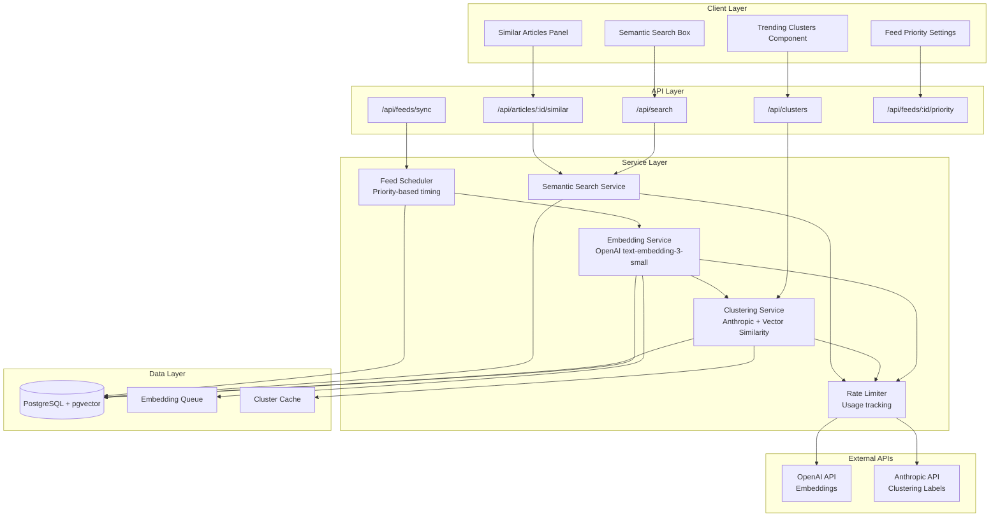

# Design Document: AI Embeddings and Topic Clustering

## Overview

This design implements a comprehensive AI-powered content intelligence system for Cronkite. The system generates vector embeddings for articles using OpenAI, clusters semantically similar articles using those embeddings with Anthropic for topic labeling, and provides semantic search capabilities. A priority-based scheduler ensures breaking news sources update hourly while less time-sensitive feeds update daily or weekly.

The architecture follows an event-driven pattern where feed syncs trigger embedding generation, which in turn triggers cluster recalculation. This ensures AI features stay synchronized with content updates while managing API costs through batching and rate limiting.

## Architecture



## Components and Interfaces

### 1. Embedding Service (`server/embedding-service.ts`)

Responsible for generating and managing article embeddings using OpenAI.

```typescript
interface EmbeddingService {
  // Generate embedding for a single article
  generateEmbedding(articleId: string): Promise<EmbeddingResult>;
  
  // Batch generate embeddings for multiple articles
  generateEmbeddingsBatch(articleIds: string[]): Promise<BatchEmbeddingResult>;
  
  // Queue articles for embedding generation
  queueForEmbedding(articleIds: string[]): Promise<void>;
  
  // Process queued embeddings
  processEmbeddingQueue(): Promise<QueueProcessResult>;
  
  // Check if article needs embedding update
  needsEmbeddingUpdate(article: Article): boolean;
}

interface EmbeddingResult {
  success: boolean;
  articleId: string;
  embedding?: number[];
  tokenCount?: number;
  error?: string;
}

interface BatchEmbeddingResult {
  successful: EmbeddingResult[];
  failed: EmbeddingResult[];
  totalTokens: number;
  processingTimeMs: number;
}

interface QueueProcessResult {
  processed: number;
  succeeded: number;
  failed: number;
  remainingInQueue: number;
}
```

### 2. Clustering Service (`server/clustering-service.ts`)

Manages vector-based article clustering with Anthropic-generated labels.

```typescript
interface ClusteringService {
  // Generate clusters from articles with embeddings
  generateClusters(userId: string): Promise<ClusterGenerationResult>;
  
  // Find articles similar to a given embedding
  findSimilarArticles(
    embedding: number[],
    options: SimilarityOptions
  ): Promise<SimilarArticle[]>;
  
  // Get clusters for a user
  getUserClusters(userId: string): Promise<ArticleCluster[]>;
  
  // Expire old clusters
  expireOldClusters(): Promise<number>;
}

interface SimilarityOptions {
  threshold: number;        // Minimum similarity score (0-1)
  maxResults: number;       // Maximum articles to return
  excludeArticleIds?: string[];
  feedIds?: string[];       // Limit to specific feeds
}

interface SimilarArticle {
  articleId: string;
  title: string;
  feedName: string;
  similarityScore: number;
  publishedAt: Date;
}

interface ClusterGenerationResult {
  clusters: ArticleCluster[];
  articlesProcessed: number;
  clustersCreated: number;
  processingTimeMs: number;
}

interface ArticleCluster {
  id: string;
  topic: string;
  summary: string;
  articleIds: string[];
  articleCount: number;
  sources: string[];
  avgSimilarity: number;
  latestTimestamp: Date;
  relevanceScore: number;
  expiresAt: Date;
}
```

### 3. Feed Scheduler (`server/feed-scheduler.ts`)

Manages priority-based feed synchronization timing.

```typescript
interface FeedScheduler {
  // Get feeds due for sync based on priority
  getFeedsDueForSync(): Promise<Feed[]>;
  
  // Schedule next sync for a feed
  scheduleNextSync(feedId: string): Promise<Date>;
  
  // Trigger manual sync for feeds
  triggerManualSync(feedIds: string[]): Promise<SyncTriggerResult>;
  
  // Update feed priority
  updateFeedPriority(feedId: string, priority: FeedPriority): Promise<void>;
  
  // Get sync schedule for user's feeds
  getSyncSchedule(userId: string): Promise<FeedSyncSchedule[]>;
}

type FeedPriority = 'high' | 'medium' | 'low';

interface FeedSyncSchedule {
  feedId: string;
  feedName: string;
  priority: FeedPriority;
  lastSyncAt: Date | null;
  nextSyncAt: Date;
  syncIntervalHours: number;
}

interface SyncTriggerResult {
  feedsTriggered: number;
  embeddingsQueued: number;
  clusteringScheduled: boolean;
}

// Priority intervals in hours
const PRIORITY_INTERVALS: Record<FeedPriority, number> = {
  high: 1,      // Every hour
  medium: 24,   // Every day
  low: 168      // Every week (7 * 24)
};

// Default high-priority sources (breaking news)
const HIGH_PRIORITY_SOURCES = [
  'nytimes.com',
  'bbc.com',
  'cnn.com',
  'reuters.com',
  'apnews.com',
  'washingtonpost.com',
  'theguardian.com'
];
```

### 4. Semantic Search Service (`server/semantic-search.ts`)

Handles natural language search using embeddings.

```typescript
interface SemanticSearchService {
  // Search articles using natural language query
  search(query: string, options: SearchOptions): Promise<SearchResult>;
  
  // Get embedding for search query
  getQueryEmbedding(query: string): Promise<number[]>;
}

interface SearchOptions {
  userId: string;
  maxResults?: number;      // Default: 50
  minScore?: number;        // Default: 0.5
  feedIds?: string[];       // Filter by feeds
  dateFrom?: Date;          // Filter by date range
  dateTo?: Date;
}

interface SearchResult {
  articles: SearchResultArticle[];
  query: string;
  totalResults: number;
  processingTimeMs: number;
  fallbackUsed: boolean;    // True if text search was used
}

interface SearchResultArticle {
  id: string;
  title: string;
  excerpt: string;
  feedName: string;
  publishedAt: Date;
  relevanceScore: number;
  imageUrl?: string;
}
```

### 5. Rate Limiter (`server/ai-rate-limiter.ts`)

Manages API usage and cost tracking.

```typescript
interface AIRateLimiter {
  // Check if operation is allowed
  canMakeRequest(userId: string, operation: AIOperation): Promise<boolean>;
  
  // Record API usage
  recordUsage(userId: string, usage: APIUsage): Promise<void>;
  
  // Get usage statistics
  getUsageStats(userId: string): Promise<UsageStats>;
  
  // Check global rate limits
  checkGlobalLimits(): Promise<RateLimitStatus>;
}

type AIOperation = 'embedding' | 'clustering' | 'search';

interface APIUsage {
  operation: AIOperation;
  provider: 'openai' | 'anthropic';
  tokenCount: number;
  estimatedCost: number;
  timestamp: Date;
}

interface UsageStats {
  daily: {
    embeddings: number;
    clusterings: number;
    searches: number;
    totalTokens: number;
    estimatedCost: number;
  };
  limits: {
    embeddingsPerDay: number;
    clusteringsPerDay: number;
    searchesPerDay: number;
  };
  resetAt: Date;
}

interface RateLimitStatus {
  openai: {
    requestsRemaining: number;
    tokensRemaining: number;
    resetAt: Date;
  };
  anthropic: {
    requestsRemaining: number;
    tokensRemaining: number;
    resetAt: Date;
  };
}
```

## Data Models

### Database Schema Updates

```sql
-- Add priority and scheduling columns to feeds table
ALTER TABLE feeds ADD COLUMN IF NOT EXISTS sync_priority TEXT NOT NULL DEFAULT 'medium'
  CHECK (sync_priority IN ('high', 'medium', 'low'));
ALTER TABLE feeds ADD COLUMN IF NOT EXISTS next_sync_at TIMESTAMPTZ;
ALTER TABLE feeds ADD COLUMN IF NOT EXISTS sync_interval_hours INTEGER NOT NULL DEFAULT 24;

-- Add embedding status tracking to articles
ALTER TABLE articles ADD COLUMN IF NOT EXISTS embedding_status TEXT NOT NULL DEFAULT 'pending'
  CHECK (embedding_status IN ('pending', 'completed', 'failed', 'skipped'));
ALTER TABLE articles ADD COLUMN IF NOT EXISTS embedding_generated_at TIMESTAMPTZ;
ALTER TABLE articles ADD COLUMN IF NOT EXISTS embedding_error TEXT;
ALTER TABLE articles ADD COLUMN IF NOT EXISTS content_hash TEXT;

-- Update clusters table for vector-based clustering
ALTER TABLE clusters ADD COLUMN IF NOT EXISTS avg_similarity FLOAT;
ALTER TABLE clusters ADD COLUMN IF NOT EXISTS relevance_score FLOAT;
ALTER TABLE clusters ADD COLUMN IF NOT EXISTS generation_method TEXT DEFAULT 'vector';

-- Create embedding queue table
CREATE TABLE IF NOT EXISTS embedding_queue (
  id UUID PRIMARY KEY DEFAULT gen_random_uuid(),
  article_id UUID NOT NULL REFERENCES articles(id) ON DELETE CASCADE,
  priority INTEGER NOT NULL DEFAULT 0,
  attempts INTEGER NOT NULL DEFAULT 0,
  last_attempt_at TIMESTAMPTZ,
  error_message TEXT,
  created_at TIMESTAMPTZ NOT NULL DEFAULT NOW(),
  UNIQUE(article_id)
);

-- Create AI usage tracking table
CREATE TABLE IF NOT EXISTS ai_usage_log (
  id UUID PRIMARY KEY DEFAULT gen_random_uuid(),
  user_id UUID REFERENCES profiles(id) ON DELETE SET NULL,
  operation TEXT NOT NULL,
  provider TEXT NOT NULL,
  token_count INTEGER NOT NULL,
  estimated_cost DECIMAL(10, 6),
  request_metadata JSONB,
  created_at TIMESTAMPTZ NOT NULL DEFAULT NOW()
);

-- Create daily usage summary table
CREATE TABLE IF NOT EXISTS ai_usage_daily (
  id UUID PRIMARY KEY DEFAULT gen_random_uuid(),
  user_id UUID NOT NULL REFERENCES profiles(id) ON DELETE CASCADE,
  date DATE NOT NULL,
  embeddings_count INTEGER NOT NULL DEFAULT 0,
  clusterings_count INTEGER NOT NULL DEFAULT 0,
  searches_count INTEGER NOT NULL DEFAULT 0,
  total_tokens INTEGER NOT NULL DEFAULT 0,
  estimated_cost DECIMAL(10, 6) NOT NULL DEFAULT 0,
  created_at TIMESTAMPTZ NOT NULL DEFAULT NOW(),
  updated_at TIMESTAMPTZ NOT NULL DEFAULT NOW(),
  UNIQUE(user_id, date)
);

-- Create indexes for performance
CREATE INDEX IF NOT EXISTS idx_feeds_next_sync ON feeds(next_sync_at) WHERE status = 'active';
CREATE INDEX IF NOT EXISTS idx_feeds_priority ON feeds(sync_priority, next_sync_at);
CREATE INDEX IF NOT EXISTS idx_articles_embedding_status ON articles(embedding_status) WHERE embedding_status = 'pending';
CREATE INDEX IF NOT EXISTS idx_embedding_queue_priority ON embedding_queue(priority DESC, created_at ASC);
CREATE INDEX IF NOT EXISTS idx_ai_usage_log_user_date ON ai_usage_log(user_id, created_at);
CREATE INDEX IF NOT EXISTS idx_ai_usage_daily_user ON ai_usage_daily(user_id, date);

-- Add default priority to recommended_feeds
ALTER TABLE recommended_feeds ADD COLUMN IF NOT EXISTS default_priority TEXT NOT NULL DEFAULT 'medium'
  CHECK (default_priority IN ('high', 'medium', 'low'));

-- Update high-priority sources
UPDATE recommended_feeds SET default_priority = 'high'
WHERE url LIKE '%nytimes.com%'
   OR url LIKE '%bbc.com%'
   OR url LIKE '%cnn.com%'
   OR url LIKE '%reuters.com%'
   OR url LIKE '%apnews.com%'
   OR url LIKE '%washingtonpost.com%'
   OR url LIKE '%theguardian.com%';
```

### TypeScript Type Definitions

```typescript
// Add to shared/schema.ts

export const feedPriorityEnum = pgEnum("feed_priority", ["high", "medium", "low"]);
export const embeddingStatusEnum = pgEnum("embedding_status", ["pending", "completed", "failed", "skipped"]);

// Embedding queue table
export const embeddingQueue = pgTable("embedding_queue", {
  id: uuid("id").primaryKey().default(sql`gen_random_uuid()`),
  article_id: uuid("article_id").notNull().references(() => articles.id, { onDelete: "cascade" }),
  priority: integer("priority").notNull().default(0),
  attempts: integer("attempts").notNull().default(0),
  last_attempt_at: timestamp("last_attempt_at", { withTimezone: true }),
  error_message: text("error_message"),
  created_at: timestamp("created_at", { withTimezone: true }).notNull().defaultNow(),
});

// AI usage log table
export const aiUsageLog = pgTable("ai_usage_log", {
  id: uuid("id").primaryKey().default(sql`gen_random_uuid()`),
  user_id: uuid("user_id").references(() => profiles.id, { onDelete: "set null" }),
  operation: text("operation").notNull(),
  provider: text("provider").notNull(),
  token_count: integer("token_count").notNull(),
  estimated_cost: text("estimated_cost"),
  request_metadata: text("request_metadata"),
  created_at: timestamp("created_at", { withTimezone: true }).notNull().defaultNow(),
});

// AI daily usage summary
export const aiUsageDaily = pgTable("ai_usage_daily", {
  id: uuid("id").primaryKey().default(sql`gen_random_uuid()`),
  user_id: uuid("user_id").notNull().references(() => profiles.id, { onDelete: "cascade" }),
  date: text("date").notNull(),
  embeddings_count: integer("embeddings_count").notNull().default(0),
  clusterings_count: integer("clusterings_count").notNull().default(0),
  searches_count: integer("searches_count").notNull().default(0),
  total_tokens: integer("total_tokens").notNull().default(0),
  estimated_cost: text("estimated_cost").notNull().default("0"),
  created_at: timestamp("created_at", { withTimezone: true }).notNull().defaultNow(),
  updated_at: timestamp("updated_at", { withTimezone: true }).notNull().defaultNow(),
});

// Type exports
export type EmbeddingQueue = typeof embeddingQueue.$inferSelect;
export type InsertEmbeddingQueue = typeof embeddingQueue.$inferInsert;
export type AIUsageLog = typeof aiUsageLog.$inferSelect;
export type InsertAIUsageLog = typeof aiUsageLog.$inferInsert;
export type AIUsageDaily = typeof aiUsageDaily.$inferSelect;
export type InsertAIUsageDaily = typeof aiUsageDaily.$inferInsert;
```


## Correctness Properties

*A property is a characteristic or behavior that should hold true across all valid executions of a system—essentially, a formal statement about what the system should do. Properties serve as the bridge between human-readable specifications and machine-verifiable correctness guarantees.*

### Property 1: Embedding Dimension Invariant

*For any* article embedding generated by the Embedding_Service, the embedding vector SHALL have exactly 1536 dimensions and be stored in the articles table.

**Validates: Requirements 1.1, 1.4**

### Property 2: Embedding Input Format Consistency

*For any* article processed by the Embedding_Service, the input text sent to OpenAI SHALL be the concatenation of the article's title and excerpt (or content if excerpt is empty).

**Validates: Requirements 1.3**

### Property 3: Embedding Idempotence on Unchanged Content

*For any* article with an existing embedding, if the content hash has not changed, calling generateEmbedding SHALL return the existing embedding without making an API call.

**Validates: Requirements 1.5**

### Property 4: Batch Size Limit

*For any* batch of articles processed by generateEmbeddingsBatch, the batch size SHALL NOT exceed 100 articles.

**Validates: Requirements 1.6**

### Property 5: Cluster Similarity Threshold

*For any* cluster generated by the Clustering_Service, all pairs of articles within the cluster SHALL have a cosine similarity score of at least 0.75.

**Validates: Requirements 2.1**

### Property 6: Cluster Source Diversity

*For any* cluster generated by the Clustering_Service, the cluster SHALL contain at least 2 articles from at least 2 different feed sources.

**Validates: Requirements 2.2**

### Property 7: Article Single-Cluster Assignment

*For any* article in the system, the article SHALL be assigned to at most one cluster at any given time.

**Validates: Requirements 2.4**

### Property 8: Cluster Relevance Score Sorting

*For any* list of clusters returned by getUserClusters, the clusters SHALL be sorted in descending order by relevance score, where relevance score = article_count × unique_source_count.

**Validates: Requirements 2.7**

### Property 9: Priority-Based Sync Interval

*For any* feed with a given priority level, the sync interval SHALL be: high = 1 hour, medium = 24 hours, low = 168 hours (7 days).

**Validates: Requirements 3.1, 3.2, 3.3**

### Property 10: Default Priority Assignment

*For any* newly created feed, the default priority SHALL be 'medium' unless the feed URL matches a known breaking news source (NYT, BBC, CNN, Reuters, AP), in which case it SHALL be 'high'.

**Validates: Requirements 3.4, 3.7**

### Property 11: Feed Sync Triggers Embedding Queue

*For any* feed sync that adds new articles, all new articles SHALL be added to the embedding queue with status 'pending'.

**Validates: Requirements 3.8, 7.1**

### Property 12: Similar Articles Search Constraints

*For any* similar articles search result: (a) the result set SHALL contain at most 5 articles, (b) all articles SHALL have similarity scores >= 0.7, (c) the source article SHALL NOT appear in results, and (d) all articles SHALL belong to the requesting user's subscribed feeds.

**Validates: Requirements 4.1, 4.2, 4.3, 4.4**

### Property 13: Semantic Search Result Constraints

*For any* semantic search result: (a) results SHALL be sorted by similarity score descending, (b) all articles SHALL belong to the user's subscribed feeds, (c) each result SHALL include a relevance score, (d) the result set SHALL contain at most 50 articles, and (e) date/feed filters SHALL be correctly applied.

**Validates: Requirements 5.2, 5.3, 5.4, 5.5, 5.7**

### Property 14: Priority Change Schedule Update

*For any* feed priority change, the next_sync_at timestamp SHALL be recalculated based on the new priority interval, and only valid priority values ('high', 'medium', 'low') SHALL be accepted.

**Validates: Requirements 6.2, 6.3**

### Property 15: Recommended Feed Priority Inheritance

*For any* feed subscribed from recommended_feeds, the feed's initial priority SHALL match the default_priority value from the recommended_feeds table.

**Validates: Requirements 6.6**

### Property 16: Embedding Status State Machine

*For any* article, the embedding_status SHALL transition only through valid states: pending → completed, pending → failed, failed → pending (on retry), and content changes SHALL reset status to pending.

**Validates: Requirements 7.3, 7.4**

### Property 17: API Usage Tracking Completeness

*For any* API call to OpenAI or Anthropic, a usage log entry SHALL be created containing: user_id, operation type, provider, token count, timestamp, and estimated cost.

**Validates: Requirements 8.1, 8.5**

### Property 18: Daily Limit Enforcement

*For any* user, when daily embedding count reaches 500 or clustering count reaches 10, subsequent requests SHALL be queued for the next day rather than executed immediately.

**Validates: Requirements 8.2, 8.3, 8.4**

### Property 19: Exponential Backoff Retry Pattern

*For any* API error response, retries SHALL follow exponential backoff with delays of 1s, 2s, 4s (doubling), and SHALL stop after 3 attempts.

**Validates: Requirements 8.7, 9.1, 9.2**

### Property 20: Failure Handling Continuation

*For any* batch operation where individual items fail, the operation SHALL continue processing remaining items and failed items SHALL be moved to a dead letter queue after max retries.

**Validates: Requirements 9.3, 9.4**

## Error Handling

### API Error Categories

| Error Type | Handling Strategy | User Impact |
|------------|-------------------|-------------|
| OpenAI Rate Limit (429) | Exponential backoff, queue for later | Delayed embeddings, cached results served |
| OpenAI Server Error (5xx) | Retry 3x, then queue | Delayed embeddings |
| Anthropic Rate Limit | Exponential backoff, queue for later | Delayed clustering |
| Anthropic Server Error | Retry 3x, then queue | Cached clusters served |
| Invalid API Key | Log alert, disable service | Graceful degradation to text search |
| Network Timeout | Retry with increased timeout | Delayed processing |
| Database Connection | Retry, circuit breaker | Service unavailable |

### Graceful Degradation

```typescript
// Fallback chain for search
async function searchWithFallback(query: string, options: SearchOptions): Promise<SearchResult> {
  try {
    // Try semantic search first
    return await semanticSearch(query, options);
  } catch (error) {
    if (isOpenAIError(error)) {
      console.warn('Semantic search unavailable, falling back to text search');
      return await textSearch(query, options);
    }
    throw error;
  }
}

// Fallback for clustering
async function getClustersFallback(userId: string): Promise<ArticleCluster[]> {
  try {
    return await clusteringService.getUserClusters(userId);
  } catch (error) {
    // Return cached clusters if available
    const cached = await clusterCache.get(userId);
    if (cached) {
      return cached;
    }
    // Return empty array as last resort
    return [];
  }
}
```

### Circuit Breaker Pattern

```typescript
interface CircuitBreakerConfig {
  failureThreshold: number;    // Number of failures before opening
  resetTimeout: number;        // Time before attempting reset (ms)
  monitorWindow: number;       // Time window for counting failures (ms)
}

const OPENAI_CIRCUIT_CONFIG: CircuitBreakerConfig = {
  failureThreshold: 5,
  resetTimeout: 60000,         // 1 minute
  monitorWindow: 300000        // 5 minutes
};

const ANTHROPIC_CIRCUIT_CONFIG: CircuitBreakerConfig = {
  failureThreshold: 5,
  resetTimeout: 60000,
  monitorWindow: 300000
};
```

## Testing Strategy

### Dual Testing Approach

This feature requires both unit tests and property-based tests:

- **Unit tests**: Verify specific examples, edge cases, API mocking, and error conditions
- **Property tests**: Verify universal properties across randomized inputs using fast-check

### Property-Based Testing Configuration

- **Library**: fast-check (TypeScript property-based testing)
- **Minimum iterations**: 100 per property test
- **Tag format**: `Feature: ai-embeddings-clustering, Property {number}: {property_text}`

### Test Categories

#### 1. Embedding Service Tests

```typescript
// Unit tests
- Should generate embedding with correct dimensions
- Should handle OpenAI API errors gracefully
- Should queue failed embeddings for retry
- Should skip embedding for unchanged content
- Should concatenate title and excerpt for input

// Property tests
- Property 1: Embedding dimension invariant
- Property 2: Embedding input format consistency
- Property 3: Embedding idempotence on unchanged content
- Property 4: Batch size limit
```

#### 2. Clustering Service Tests

```typescript
// Unit tests
- Should create cluster with Anthropic-generated title
- Should expire clusters after 48 hours
- Should handle Anthropic API errors gracefully

// Property tests
- Property 5: Cluster similarity threshold
- Property 6: Cluster source diversity
- Property 7: Article single-cluster assignment
- Property 8: Cluster relevance score sorting
```

#### 3. Feed Scheduler Tests

```typescript
// Unit tests
- Should trigger manual sync regardless of schedule
- Should trigger clustering after embedding completion
- Should identify breaking news sources

// Property tests
- Property 9: Priority-based sync interval
- Property 10: Default priority assignment
- Property 11: Feed sync triggers embedding queue
```

#### 4. Search and Similarity Tests

```typescript
// Unit tests
- Should fall back to text search on API failure
- Should cache similarity results
- Should handle empty search queries

// Property tests
- Property 12: Similar articles search constraints
- Property 13: Semantic search result constraints
```

#### 5. Rate Limiting and Error Handling Tests

```typescript
// Unit tests
- Should track API usage per user
- Should alert on high error rates
- Should serve cached data during outages

// Property tests
- Property 17: API usage tracking completeness
- Property 18: Daily limit enforcement
- Property 19: Exponential backoff retry pattern
- Property 20: Failure handling continuation
```

### Test Data Generators

```typescript
import * as fc from 'fast-check';

// Article generator
const articleArb = fc.record({
  id: fc.uuid(),
  title: fc.string({ minLength: 10, maxLength: 200 }),
  excerpt: fc.string({ minLength: 50, maxLength: 500 }),
  feedId: fc.uuid(),
  feedName: fc.string({ minLength: 3, maxLength: 50 }),
  publishedAt: fc.date()
});

// Embedding generator (1536 dimensions)
const embeddingArb = fc.array(
  fc.float({ min: -1, max: 1 }),
  { minLength: 1536, maxLength: 1536 }
);

// Priority generator
const priorityArb = fc.constantFrom('high', 'medium', 'low');

// Similarity score generator
const similarityScoreArb = fc.float({ min: 0, max: 1 });
```
