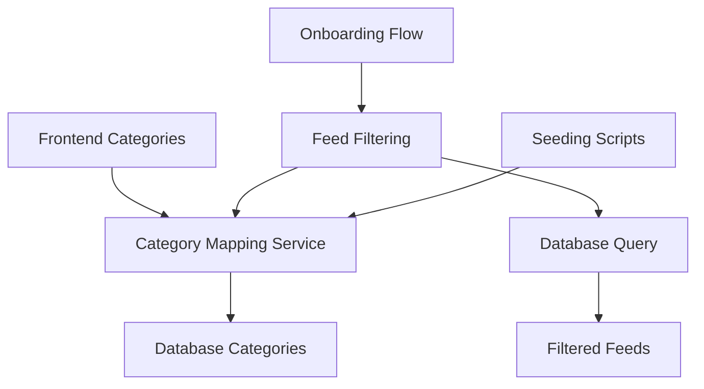

# Design Document

## Overview

This design addresses the category mismatch issue preventing feeds from appearing in the onboarding flow. The solution implements a category mapping system that translates between frontend category IDs (lowercase) and database category names (capitalized), ensuring feeds are properly filtered and displayed.

## Architecture

The solution consists of three main components:

1. **Category Mapping Service**: Centralized mapping between frontend and database categories
2. **Feed Filtering Enhancement**: Updated filtering logic that uses category mapping
3. **Database Seeding Updates**: Modified seeding scripts that use consistent category names



## Components and Interfaces

### Category Mapping Service

**Location**: `shared/category-mapping.ts`

```typescript
interface CategoryMapping {
  frontendId: string;
  databaseName: string;
  aliases?: string[];
}

interface CategoryMappingService {
  // Convert frontend category ID to database category name
  frontendToDatabase(frontendId: string): string | null;
  
  // Convert database category name to frontend category ID
  databaseToFrontend(databaseName: string): string | null;
  
  // Get all valid frontend category IDs
  getAllFrontendCategories(): string[];
  
  // Get all valid database category names
  getAllDatabaseCategories(): string[];
  
  // Validate if a category mapping exists
  isValidFrontendCategory(frontendId: string): boolean;
  isValidDatabaseCategory(databaseName: string): boolean;
}
```

### Enhanced Feed Filtering

**Location**: `server/feed-filtering-validation.ts` (existing file)

```typescript
interface EnhancedFilterOptions extends FilterOptions {
  // Existing options remain the same
  category?: string; // Frontend category ID
}

// Enhanced filtering function that uses category mapping
function filterFeedsByInterestsWithMapping(
  feeds: RecommendedFeed[],
  interests: string[], // Frontend category IDs
  categoryMapping: CategoryMappingService
): FilteringResult;
```

### Updated Storage Interface

**Location**: `server/storage.ts` (existing interface)

```typescript
interface IStorage {
  // Existing methods remain the same
  
  // Enhanced method with category mapping support
  getRecommendedFeedsByCategories(
    frontendCategories: string[]
  ): Promise<RecommendedFeed[]>;
}
```

## Data Models

### Category Mapping Configuration

```typescript
const CATEGORY_MAPPINGS: CategoryMapping[] = [
  { frontendId: 'tech', databaseName: 'Technology' },
  { frontendId: 'business', databaseName: 'Business' },
  { frontendId: 'gaming', databaseName: 'Gaming' },
  { frontendId: 'sports', databaseName: 'Sports' },
  { frontendId: 'science', databaseName: 'Science' },
  { frontendId: 'space', databaseName: 'Space' },
  { frontendId: 'news', databaseName: 'News' },
  { frontendId: 'movies', databaseName: 'Entertainment', aliases: ['Movies'] },
  { frontendId: 'music', databaseName: 'Music' },
  { frontendId: 'books', databaseName: 'Books' },
  { frontendId: 'food', databaseName: 'Food' },
  { frontendId: 'travel', databaseName: 'Travel' },
  { frontendId: 'programming', databaseName: 'Programming' },
  { frontendId: 'design', databaseName: 'Design' },
  { frontendId: 'cars', databaseName: 'Automotive', aliases: ['Cars'] },
  { frontendId: 'diy', databaseName: 'DIY' },
  { frontendId: 'android', databaseName: 'Android' },
  { frontendId: 'apple', databaseName: 'Apple' },
  { frontendId: 'history', databaseName: 'History' },
  { frontendId: 'funny', databaseName: 'Humor', aliases: ['Funny'] },
  { frontendId: 'beauty', databaseName: 'Beauty' },
  { frontendId: 'fashion', databaseName: 'Fashion' },
  { frontendId: 'startups', databaseName: 'Startups' },
  { frontendId: 'cricket', databaseName: 'Cricket' },
  { frontendId: 'football', databaseName: 'Football' },
  { frontendId: 'tennis', databaseName: 'Tennis' },
  { frontendId: 'photography', databaseName: 'Photography' },
  { frontendId: 'interior', databaseName: 'Interior' }
];
```

### Database Schema Considerations

The existing `recommended_feeds` table structure remains unchanged:

```sql
-- No schema changes required
-- The category column continues to store database category names
-- Mapping happens at the application layer
```

## Correctness Properties

*A property is a characteristic or behavior that should hold true across all valid executions of a system-essentially, a formal statement about what the system should do. Properties serve as the bridge between human-readable specifications and machine-verifiable correctness guarantees.*

<function_calls>
<invoke name="prework">
<parameter name="featureName">database-configuration-fix

### Property Reflection

After reviewing the prework analysis, I identified several redundant properties that can be consolidated:

- Properties 1.2, 2.3, and 2.4 all test category mapping functionality and can be combined into one comprehensive mapping property
- Properties 3.1, 3.2, 5.2, and 5.5 all test seeding validation and can be combined into one seeding consistency property
- Properties 2.1 and 2.5 test mapping completeness and can be combined

### Core Properties

**Property 1: Category mapping bidirectional consistency**
*For any* valid frontend category ID, mapping to database category and back should return the original frontend category ID
**Validates: Requirements 1.2, 2.1, 2.3, 2.4**

**Property 2: Interest-based feed filtering accuracy**
*For any* set of user interests, all returned feeds should have database categories that map to those frontend interest categories
**Validates: Requirements 1.1**

**Property 3: Seeding category consistency**
*For any* feed inserted during seeding, its category should have a valid mapping to a frontend category ID
**Validates: Requirements 3.1, 3.2, 5.2, 5.5**

**Property 4: Mapping completeness validation**
*For all* frontend categories defined in the system, there should exist a corresponding database category mapping
**Validates: Requirements 2.5, 3.3**

**Property 5: Fallback behavior on mapping failure**
*For any* unmapped category, the system should log a warning and attempt case-insensitive matching as fallback
**Validates: Requirements 1.5**

**Property 6: Database connectivity fallback**
*For any* database connectivity failure, the system should fall back to in-memory storage with appropriate logging
**Validates: Requirements 4.4**

**Property 7: Feed storage category validation**
*For any* feed stored in the database, its category should be a valid database category name from the mapping
**Validates: Requirements 2.2**

**Property 8: Seeding rejection of invalid categories**
*For any* feed with an unmapped category name, the seeding process should reject it during validation
**Validates: Requirements 3.5**

## Error Handling

### Category Mapping Errors

1. **Unknown Frontend Category**: Log warning, attempt fuzzy matching, return null if no match
2. **Unknown Database Category**: Log warning, attempt case-insensitive matching, return null if no match
3. **Circular Mapping**: Validate mappings on startup to prevent circular references

### Database Connectivity Errors

1. **Connection Failure**: Fall back to MemStorage with 105 mock feeds
2. **Query Timeout**: Retry with exponential backoff, fall back to MemStorage if persistent
3. **Empty Results**: Log warning, check if database is properly seeded

### Feed Filtering Errors

1. **No Matching Feeds**: Return empty array with appropriate logging
2. **Invalid Interest Categories**: Filter out invalid categories, proceed with valid ones
3. **Malformed Feed Data**: Skip malformed feeds, log errors for debugging

## Testing Strategy

### Unit Tests

- Test category mapping service with known input/output pairs
- Test error handling for unmapped categories
- Test database fallback behavior
- Test feed filtering with various interest combinations

### Property-Based Tests

Each correctness property will be implemented as a property-based test with minimum 100 iterations:

- **Property 1**: Generate random frontend categories, test bidirectional mapping consistency
- **Property 2**: Generate random interest sets, verify all returned feeds match interests
- **Property 3**: Generate random feeds, verify seeded categories have valid mappings
- **Property 4**: Test that all frontend categories have database mappings
- **Property 5**: Test fallback behavior with unmapped categories
- **Property 6**: Test database fallback with simulated connection failures
- **Property 7**: Test that stored feeds have valid database categories
- **Property 8**: Test that invalid categories are rejected during seeding

### Integration Tests

- Test complete onboarding flow with category mapping
- Test seeding scripts with category validation
- Test API endpoints with category filtering
- Test fallback scenarios end-to-end

## Implementation Notes

### Backward Compatibility

- Existing feeds in the database will continue to work
- The mapping service handles both old and new category formats
- Gradual migration strategy for updating existing data

### Performance Considerations

- Category mapping uses in-memory lookup tables for O(1) performance
- Caching of frequently accessed mappings
- Minimal impact on existing feed filtering performance

### Development vs Production

- **Development**: 105 feeds across all categories for faster testing
- **Production**: 865 feeds with full category coverage
- Same category mapping logic works for both environments
- Environment-specific seeding scripts maintain proper ratios