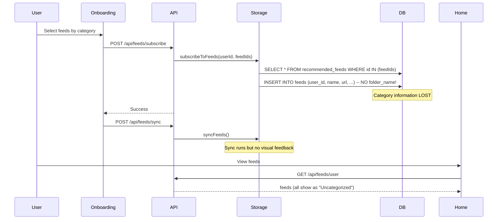
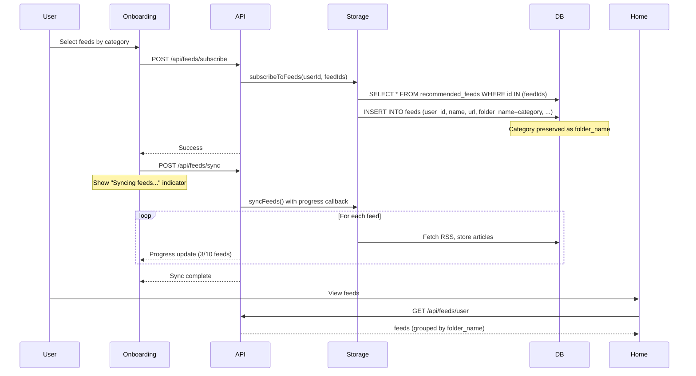

# Design Document: Feed Onboarding Fixes

## Overview

This design addresses three critical issues in the feed onboarding and display flow:

1. **Category Loss**: Categories from `recommended_feeds` are not being copied to user's `feeds` table during subscription
2. **No Articles**: RSS sync may not be completing successfully or articles aren't being displayed
3. **Onboarding UX**: Too many feeds per category makes selection overwhelming

The solution involves:
- Modifying `subscribeToFeeds()` to preserve category information
- Adding visual feedback during RSS synchronization
- Improving the onboarding feed selection UI with featured feeds and search

## Architecture

### Current Data Flow (Broken)



### Fixed Data Flow



## Components and Interfaces

### 1. Storage Layer Changes

#### Modified: `subscribeToFeeds()` in `server/supabase-storage.ts`

```typescript
async subscribeToFeeds(userId: string, feedIds: string[]): Promise<void> {
  // Get recommended feeds to create user feeds from
  const { data: recommendedFeeds, error: fetchError } = await this.supabase
    .from('recommended_feeds')
    .select('*')
    .in('id', feedIds);
  
  if (fetchError) {
    throw new Error(`Failed to fetch recommended feeds: ${fetchError.message}`);
  }
  
  if (!recommendedFeeds || recommendedFeeds.length === 0) {
    return;
  }
  
  // Create user feeds from recommended feeds - PRESERVE CATEGORY AS folder_name
  const userFeedsData = recommendedFeeds.map(recommendedFeed => ({
    user_id: userId,
    name: recommendedFeed.name,
    url: recommendedFeed.url,
    site_url: recommendedFeed.site_url,
    description: recommendedFeed.description,
    icon_url: recommendedFeed.icon_url,
    folder_name: recommendedFeed.category,  // <-- NEW: Copy category to folder_name
    status: "active" as const,
    priority: "medium" as const,
  }));
  
  const { error: insertError } = await this.supabase
    .from('feeds')
    .insert(userFeedsData);
  
  if (insertError) {
    throw new Error(`Failed to subscribe to feeds: ${insertError.message}`);
  }
}
```

#### Database Schema Update

The `feeds` table needs a `folder_name` column. Check if it exists, if not add via migration:

```sql
-- Add folder_name column to feeds table if not exists
ALTER TABLE feeds ADD COLUMN IF NOT EXISTS folder_name TEXT;

-- Create index for efficient grouping
CREATE INDEX IF NOT EXISTS idx_feeds_folder_name ON feeds(user_id, folder_name);
```

### 2. Sync Status API

#### New Endpoint: `GET /api/feeds/sync/status`

Returns current sync status for visual feedback:

```typescript
interface SyncStatusResponse {
  isActive: boolean;
  totalFeeds: number;
  completedFeeds: number;
  failedFeeds: number;
  currentFeed?: string;
  errors: Array<{ feedName: string; error: string }>;
}
```

#### Modified: `POST /api/feeds/sync`

Add progress tracking and return detailed results:

```typescript
interface SyncResponse {
  success: boolean;
  totalFeeds: number;
  successfulSyncs: number;
  failedSyncs: number;
  newArticles: number;
  errors: Array<{ feedId: string; feedName: string; error: string }>;
}
```

### 3. Client Components

#### Modified: `ConfirmationStep.tsx`

Add sync progress UI:

```typescript
interface SyncState {
  status: 'idle' | 'syncing' | 'complete' | 'error';
  progress: { current: number; total: number };
  message: string;
  errors: string[];
}
```

#### Modified: `MasonryGrid.tsx` / Home Page

Add loading and empty states:

- **Loading State**: "Fetching your articles..." with spinner
- **Empty State**: "No articles yet. Your feeds are being synchronized. Articles will appear shortly."
- **Error State**: "Some feeds couldn't be synced. [Retry]"

### 4. Onboarding Feed Selection

#### Modified: `InterestSelector.tsx` or Feed Selection Component

```typescript
interface FeedSelectionProps {
  category: string;
  feeds: RecommendedFeed[];
  selectedFeedIds: Set<string>;
  onToggleFeed: (feedId: string) => void;
}

// State
const [showAll, setShowAll] = useState(false);
const [searchQuery, setSearchQuery] = useState('');

// Display logic
const sortedFeeds = feeds.sort((a, b) => {
  // Featured first, then by popularity
  if (a.is_featured !== b.is_featured) return b.is_featured ? 1 : -1;
  return b.popularity_score - a.popularity_score;
});

const filteredFeeds = searchQuery 
  ? sortedFeeds.filter(f => 
      f.name.toLowerCase().includes(searchQuery.toLowerCase()) ||
      f.description?.toLowerCase().includes(searchQuery.toLowerCase())
    )
  : sortedFeeds;

const displayedFeeds = showAll ? filteredFeeds : filteredFeeds.slice(0, 6);
```

## Data Models

### Extended Feed Type

```typescript
// In shared/schema.ts or client types
interface Feed {
  id: string;
  user_id: string;
  folder_id?: string;
  folder_name?: string;  // Category name for grouping
  name: string;
  url: string;
  site_url?: string;
  description?: string;
  icon_url?: string;
  status: 'active' | 'paused' | 'error';
  priority: 'high' | 'medium' | 'low';
  article_count: number;
  // ... other fields
}
```

### Sync Progress Type

```typescript
interface SyncProgress {
  feedId: string;
  feedName: string;
  status: 'pending' | 'syncing' | 'success' | 'error';
  articlesFound?: number;
  error?: string;
}
```

## Correctness Properties

*A property is a characteristic or behavior that should hold true across all valid executions of a system—essentially, a formal statement about what the system should do. Properties serve as the bridge between human-readable specifications and machine-verifiable correctness guarantees.*

### Property 1: Category Preservation Round-Trip

*For any* recommended feed with a category, when a user subscribes to that feed, the resulting user feed record SHALL have `folder_name` equal to the source `category`.

**Validates: Requirements 1.1, 1.4**

### Property 2: Feed Grouping Preserves All Feeds

*For any* set of user feeds, grouping by `folder_name` SHALL result in a collection where the total count of feeds across all groups equals the original feed count.

**Validates: Requirements 1.2**

### Property 3: Sync Resilience

*For any* batch of feeds being synchronized, if one feed fails to sync, the system SHALL continue syncing remaining feeds and report partial success.

**Validates: Requirements 2.4**

### Property 4: Article Ordering

*For any* set of articles displayed in the masonry grid, articles SHALL be sorted by `published_at` in descending order (newest first).

**Validates: Requirements 2.5**

### Property 5: Featured Feed Priority

*For any* category with both featured and non-featured feeds, featured feeds SHALL appear before non-featured feeds, and within each group, feeds SHALL be sorted by `popularity_score` descending.

**Validates: Requirements 3.1**

### Property 6: Initial Feed Display Limit

*For any* category with more than 6 feeds, the initial display SHALL show exactly 6 feeds (the top 6 by the sorting criteria in Property 5).

**Validates: Requirements 3.2**

### Property 7: Feed Card Content Completeness

*For any* feed displayed in the onboarding selection, the rendered card SHALL contain the feed name, description (if available), and a popularity indicator.

**Validates: Requirements 3.5**

## Error Handling

### Feed Subscription Errors

| Error | Handling |
|-------|----------|
| Recommended feed not found | Skip missing feeds, subscribe to valid ones |
| Duplicate subscription | Ignore (upsert behavior) |
| Database error | Throw error, rollback transaction |

### Sync Errors

| Error | Handling |
|-------|----------|
| RSS fetch timeout | Log error, mark feed as error, continue |
| Invalid RSS format | Log error, mark feed as error, continue |
| Database write error | Log error, retry once, then continue |
| All feeds fail | Return error response with details |

### UI Error States

| State | Display |
|-------|---------|
| Sync in progress | "Syncing your feeds... (3/10)" |
| Partial failure | "Some feeds couldn't be synced. [Retry Failed]" |
| Complete failure | "Unable to sync feeds. Please try again." |
| No articles | "No articles yet. Feeds are being updated." |

## Testing Strategy

### Unit Tests

1. **`subscribeToFeeds` function**: Verify category is copied to folder_name
2. **`groupFeedsByCategory` function**: Verify correct grouping logic
3. **Feed sorting**: Verify featured-first, popularity-second ordering
4. **Feed filtering**: Verify search/filter functionality

### Property-Based Tests (using fast-check)

Property tests will use the `fast-check` library for TypeScript. Each test should run minimum 100 iterations.

1. **Property 1**: Generate random recommended feeds, subscribe, verify folder_name matches category
2. **Property 2**: Generate random feeds with various folder_names, verify grouping preserves count
3. **Property 4**: Generate random articles with dates, verify sorting is correct
4. **Property 5**: Generate random feeds with featured flags and scores, verify ordering
5. **Property 6**: Generate categories with varying feed counts, verify limit behavior

### Integration Tests

1. **End-to-end onboarding flow**: Complete onboarding, verify feeds appear with correct categories
2. **Sync flow**: Subscribe to feeds, trigger sync, verify articles appear
3. **Error recovery**: Simulate sync failures, verify partial success handling

### Manual Testing Checklist

- [ ] Complete onboarding with multiple categories
- [ ] Verify sidebar shows feeds grouped by category
- [ ] Verify sync progress indicator appears
- [ ] Verify articles appear after sync completes
- [ ] Verify "Show more" reveals additional feeds
- [ ] Verify search filters feeds correctly
- [ ] Verify error states display correctly
