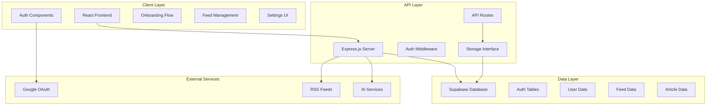
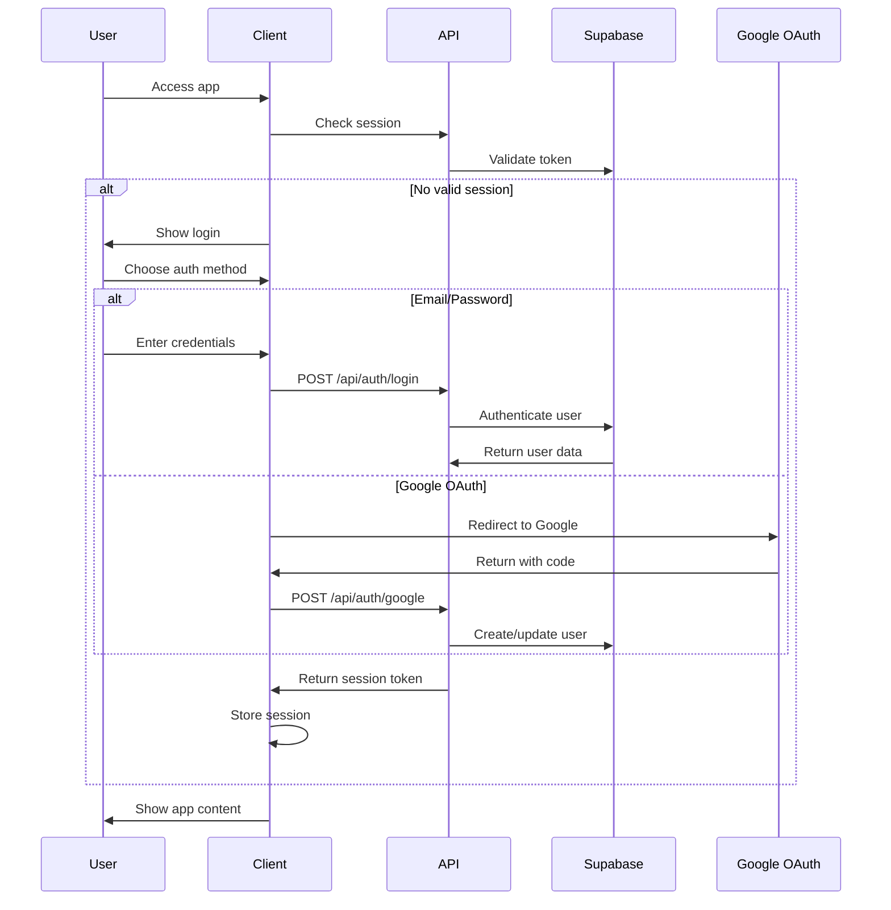

# Full-Stack Integration Design Document

## Overview

This design document outlines the complete integration of the Cronkite news aggregation platform, connecting the existing React frontend with the Express.js backend and Supabase database. The system will provide a seamless user experience from authentication through personalized news consumption, including user onboarding, feed management, article interaction, and AI-powered content insights.

The architecture follows a modern full-stack approach with clear separation of concerns: React frontend for user interface, Express.js API layer for business logic, and Supabase for data persistence and authentication. The system leverages existing database schemas and UI components while adding the necessary API endpoints and authentication flows.

## Architecture

### System Architecture



### Authentication Flow



## Components and Interfaces

### API Endpoints

#### Authentication Endpoints
- `POST /api/auth/register` - Email/password registration
- `POST /api/auth/login` - Email/password login
- `POST /api/auth/google` - Google OAuth callback
- `POST /api/auth/logout` - User logout
- `GET /api/auth/me` - Get current user profile

#### User Management Endpoints
- `GET /api/users/profile` - Get user profile
- `PUT /api/users/profile` - Update user profile
- `GET /api/users/settings` - Get user settings
- `PUT /api/users/settings` - Update user settings
- `POST /api/users/interests` - Set user interests
- `GET /api/users/onboarding-status` - Check onboarding completion

#### Feed Management Endpoints
- `GET /api/feeds/recommended` - Get recommended feeds list
- `GET /api/feeds/user` - Get user's subscribed feeds
- `POST /api/feeds/subscribe` - Subscribe to feeds
- `DELETE /api/feeds/unsubscribe/:id` - Unsubscribe from feed
- `POST /api/feeds/sync` - Trigger feed synchronization
- `GET /api/feeds/sync-status` - Get synchronization status

#### Article Endpoints
- `GET /api/articles` - Get user's article feed with pagination
- `GET /api/articles/:id` - Get specific article content
- `PUT /api/articles/:id/star` - Star/unstar article
- `PUT /api/articles/:id/read` - Mark article as read/unread
- `DELETE /api/articles/:id` - Remove article from feed
- `GET /api/articles/search` - Search articles

#### AI Insights Endpoints
- `GET /api/insights/clusters` - Get trending topic clusters
- `GET /api/insights/cluster/:id` - Get articles for specific cluster
- `POST /api/insights/generate` - Trigger cluster generation

### Storage Interface Extensions

```typescript
interface IStorage {
  // User Management
  getUser(id: string): Promise<Profile | undefined>;
  getUserByEmail(email: string): Promise<Profile | undefined>;
  createUser(user: InsertProfile): Promise<Profile>;
  updateUser(id: string, updates: Partial<Profile>): Promise<Profile>;
  
  // User Settings
  getUserSettings(userId: string): Promise<UserSettings | undefined>;
  updateUserSettings(userId: string, settings: Partial<UserSettings>): Promise<UserSettings>;
  
  // User Interests
  setUserInterests(userId: string, interests: string[]): Promise<void>;
  getUserInterests(userId: string): Promise<UserInterests[]>;
  
  // Feed Management
  getRecommendedFeeds(): Promise<RecommendedFeed[]>;
  getUserFeeds(userId: string): Promise<Feed[]>;
  subscribeTo Feeds(userId: string, feedIds: string[]): Promise<void>;
  unsubscribeFromFeed(userId: string, feedId: string): Promise<void>;
  
  // Article Management
  getUserArticles(userId: string, options: ArticleQueryOptions): Promise<Article[]>;
  getArticle(id: string): Promise<Article | undefined>;
  updateArticleStatus(userId: string, articleId: string, updates: ArticleStatusUpdate): Promise<void>;
  removeArticle(userId: string, articleId: string): Promise<void>;
  
  // AI Insights
  getTopicClusters(userId: string): Promise<TopicCluster[]>;
  getClusterArticles(clusterId: string): Promise<Article[]>;
}
```

### Frontend State Management

The frontend will use TanStack Query for server state management with the following query keys:

- `['auth', 'me']` - Current user profile
- `['users', 'settings']` - User settings
- `['feeds', 'recommended']` - Recommended feeds
- `['feeds', 'user']` - User subscribed feeds
- `['articles', filters]` - Article feed with filters
- `['articles', id]` - Specific article
- `['insights', 'clusters']` - Topic clusters

## Data Models

### Extended Article Model

```typescript
interface Article {
  id: string;
  title: string;
  excerpt: string;
  content: string;
  url: string;
  source: string;
  author?: string;
  publishedAt: Date;
  imageUrl?: string;
  readTime: number;
  tags: string[];
  
  // User-specific fields
  isStarred: boolean;
  isRead: boolean;
  relevancyScore: number;
  
  // AI-generated fields
  summary?: string;
  clusterId?: string;
  
  // Metadata
  createdAt: Date;
  updatedAt: Date;
}
```

### Topic Cluster Model

```typescript
interface TopicCluster {
  id: string;
  title: string;
  description: string;
  articleCount: number;
  trendingScore: number;
  keywords: string[];
  createdAt: Date;
  expiresAt: Date;
}
```

### Authentication Context

```typescript
interface AuthContext {
  user: Profile | null;
  isLoading: boolean;
  isAuthenticated: boolean;
  login: (email: string, password: string) => Promise<void>;
  loginWithGoogle: () => Promise<void>;
  register: (email: string, password: string, displayName: string) => Promise<void>;
  logout: () => Promise<void>;
  updateProfile: (updates: Partial<Profile>) => Promise<void>;
}
```

## Correctness Properties

*A property is a characteristic or behavior that should hold true across all valid executions of a system-essentially, a formal statement about what the system should do. Properties serve as the bridge between human-readable specifications and machine-verifiable correctness guarantees.*

### Property Reflection

After reviewing all properties identified in the prework, several can be consolidated to eliminate redundancy:

- Properties 1.2, 1.3, and 1.4 can be combined into a comprehensive authentication property
- Properties 2.4 and 2.5 can be combined into an onboarding completion property  
- Properties 3.1, 3.2, and 3.3 can be combined into a comprehensive sync property
- Properties 4.3, 4.4, and 4.5 can be combined into an article interaction property
- Properties 5.2, 5.4, and 5.5 can be combined into a settings update property
- Properties 6.1, 6.2, and 6.3 can be combined into an AI clustering property

Property 1: Authentication round trip
*For any* valid authentication method (email/password or Google OAuth), successful authentication should create a user session and redirect to the appropriate next step
**Validates: Requirements 1.2, 1.3, 1.4**

Property 2: Authentication error handling
*For any* invalid authentication attempt, the system should display appropriate error messages while maintaining form state
**Validates: Requirements 1.5**

Property 3: Feed search functionality
*For any* search query in the feed selection interface, returned results should match the search criteria
**Validates: Requirements 2.2**

Property 4: Feed selection state management
*For any* feed selection or deselection, the UI should provide visual feedback and maintain accurate selection state
**Validates: Requirements 2.3**

Property 5: Onboarding completion workflow
*For any* completed onboarding with selected feeds, the system should persist subscriptions and trigger initial synchronization
**Validates: Requirements 2.4, 2.5**

Property 6: Feed synchronization completeness
*For any* feed synchronization operation, all subscribed feeds should be processed and articles should be parsed, stored, and displayed
**Validates: Requirements 3.1, 3.2, 3.3**

Property 7: Sync error resilience
*For any* feed synchronization with errors, the system should log errors, continue processing remaining feeds, and complete successfully
**Validates: Requirements 3.4**

Property 8: Article interaction persistence
*For any* article interaction (star, read, delete), the action should be persisted to the database and reflected in the UI
**Validates: Requirements 4.3, 4.4, 4.5**

Property 9: Article display consistency
*For any* user feed view, articles should be displayed in masonry grid layout with proper previews and click-to-read functionality
**Validates: Requirements 4.1, 4.2**

Property 10: Settings management workflow
*For any* settings modification, changes should be immediately applied, persisted to the database, and reflected across the application
**Validates: Requirements 5.2, 5.4, 5.5**

Property 11: Settings display accuracy
*For any* user accessing settings, current feed subscriptions and preferences should be accurately displayed
**Validates: Requirements 5.1**

Property 12: Manual sync functionality
*For any* user-triggered re-synchronization, the system should fetch new articles from all subscribed feeds
**Validates: Requirements 5.3**

Property 13: AI clustering workflow
*For any* sufficient article collection, the system should generate vector embeddings, create topic clusters, and display trending topic cards
**Validates: Requirements 6.1, 6.2, 6.3**

Property 14: Cluster navigation
*For any* topic cluster card click, the system should display all articles related to that trending topic
**Validates: Requirements 6.4**

Property 15: Dynamic cluster updates
*For any* new articles added to the system, existing clusters should be updated and new clusters created as appropriate
**Validates: Requirements 6.5**

Property 16: Error handling consistency
*For any* system error (network, sync, database), the system should display user-friendly messages and maintain application stability
**Validates: Requirements 7.1, 7.2, 7.3**

Property 17: Session management
*For any* authentication expiry, the system should prompt for re-authentication without losing user context
**Validates: Requirements 7.4**

## Error Handling

### Client-Side Error Handling

The frontend will implement comprehensive error boundaries and error states:

- **Network Errors**: Display retry mechanisms with exponential backoff
- **Authentication Errors**: Clear error messages with form validation
- **Loading States**: Skeleton loaders and progress indicators
- **Offline Support**: Cache critical data and queue actions for when connectivity returns

### Server-Side Error Handling

The API will implement structured error responses:

```typescript
interface APIError {
  code: string;
  message: string;
  details?: any;
  timestamp: Date;
}
```

Error categories:
- `AUTH_REQUIRED` - Authentication needed
- `INVALID_INPUT` - Validation errors
- `RESOURCE_NOT_FOUND` - 404 errors
- `RATE_LIMITED` - Too many requests
- `INTERNAL_ERROR` - Server errors

### Feed Synchronization Error Handling

Feed sync operations will implement robust error handling:

- **Individual Feed Failures**: Log errors but continue processing other feeds
- **Rate Limiting**: Implement exponential backoff for feed requests
- **Malformed Content**: Skip invalid articles but process valid ones
- **Network Timeouts**: Retry with increasing delays

## Testing Strategy

### Dual Testing Approach

The system will implement both unit testing and property-based testing to ensure comprehensive coverage:

**Unit Testing Requirements:**
- Unit tests verify specific examples, edge cases, and error conditions
- Integration tests verify component interactions and API endpoints
- Unit tests cover authentication flows, API endpoints, and UI components
- Mock external services (RSS feeds, Google OAuth) for consistent testing

**Property-Based Testing Requirements:**
- Property tests verify universal properties across all inputs using **fast-check** for JavaScript/TypeScript
- Each property-based test will run a minimum of 100 iterations
- Property tests will be tagged with comments referencing design document properties
- Tag format: `**Feature: full-stack-integration, Property {number}: {property_text}**`
- Each correctness property will be implemented by a single property-based test

**Testing Framework Selection:**
- **Unit Testing**: Vitest for fast test execution with TypeScript support
- **Property-Based Testing**: fast-check library for generating test cases
- **Integration Testing**: Supertest for API endpoint testing
- **Frontend Testing**: React Testing Library for component testing

### Test Coverage Requirements

- **API Endpoints**: Test all success and error scenarios
- **Authentication**: Test all auth methods and edge cases
- **Feed Operations**: Test sync, subscription, and error handling
- **Article Management**: Test CRUD operations and user interactions
- **AI Features**: Test clustering and insight generation
- **Error Scenarios**: Test network failures, invalid data, and edge cases

### Mock Data Strategy

- **Development**: Use existing mock data for consistent development experience
- **Testing**: Generate realistic test data that matches production schemas
- **RSS Feeds**: Mock RSS responses for reliable testing
- **AI Services**: Mock clustering and embedding generation for fast tests

## Performance Considerations

### Database Optimization

- **Indexing**: Proper indexes on user_id, feed_id, and article queries
- **Connection Pooling**: Efficient database connection management
- **Query Optimization**: Use database views and functions for complex queries

### Caching Strategy

- **Client-Side**: TanStack Query for intelligent caching and background updates
- **Server-Side**: Redis for session storage and frequently accessed data
- **CDN**: Static assets and images served through CDN

### Feed Synchronization Performance

- **Batch Processing**: Process multiple feeds concurrently with rate limiting
- **Incremental Updates**: Use ETags and Last-Modified headers to avoid unnecessary fetches
- **Background Jobs**: Queue-based processing for heavy operations

## Security Considerations

### Authentication Security

- **Password Hashing**: Use bcrypt with appropriate salt rounds
- **Session Management**: Secure session tokens with proper expiration
- **OAuth Security**: Validate OAuth state parameters and tokens

### API Security

- **Rate Limiting**: Implement per-user and per-endpoint rate limits
- **Input Validation**: Validate all inputs using Zod schemas
- **CORS Configuration**: Proper CORS setup for production deployment

### Data Privacy

- **User Data**: Encrypt sensitive user information
- **Feed URLs**: Validate and sanitize RSS feed URLs
- **Content Filtering**: Basic content validation for article storage

## Deployment Architecture

### Environment Configuration

- **Development**: Local Supabase instance with mock data
- **Staging**: Supabase cloud instance with test data
- **Production**: Supabase cloud with proper backup and monitoring

### CI/CD Pipeline

- **Testing**: Run all unit and property tests on every commit
- **Building**: Build and optimize frontend assets
- **Deployment**: Deploy to Netlify with proper environment variables

### Monitoring and Logging

- **Application Logs**: Structured logging for debugging and monitoring
- **Performance Metrics**: Track API response times and error rates
- **User Analytics**: Basic usage analytics for feature optimization