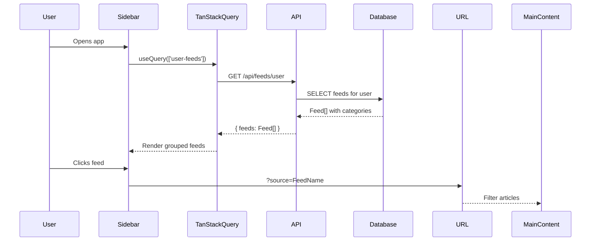

# Design Document: Left Navigation & Flagship Feeds

## Overview

This design addresses two related improvements to Cronkite:
1. Identifying ~100 "flagship" feeds for priority maintenance while keeping all ~865 feeds available
2. Replacing hardcoded mock data in the left sidebar with dynamic, real user subscription data

The current sidebar in `AppShell.tsx` contains hardcoded feed items like "TechCrunch", "Ars Technica", "The Verge", "BBC News", and "NPR" with fake article counts. This will be replaced with a dynamic component that fetches the user's actual subscribed feeds from the API.

## Architecture

### Component Structure

```
AppShell.tsx
├── Header (unchanged)
├── Sidebar
│   ├── AddFeedButton
│   ├── NavItems (All Articles, Unread, Starred, Settings)
│   └── FeedsList (NEW - dynamic component)
│       ├── useFeedsQuery (TanStack Query hook)
│       ├── CategoryFolder (collapsible)
│       │   └── FeedItem (clickable, filterable)
│       └── EmptyState (when no subscriptions)
└── MainContent
```

### Data Flow



## Components and Interfaces

### FeedsList Component

```typescript
interface FeedsListProps {
  onFeedSelect?: (feedId: string, feedName: string) => void;
  onCategorySelect?: (category: string) => void;
}

interface GroupedFeeds {
  [category: string]: Feed[];
}
```

### useFeedsQuery Hook

```typescript
// Uses TanStack Query for caching and automatic refetching
const useFeedsQuery = () => {
  return useQuery({
    queryKey: ['user-feeds'],
    queryFn: () => apiRequest('GET', '/api/feeds/user'),
    staleTime: 5 * 60 * 1000, // 5 minutes
  });
};
```

### Feed Grouping Logic

```typescript
function groupFeedsByCategory(feeds: Feed[]): GroupedFeeds {
  return feeds.reduce((acc, feed) => {
    const category = feed.category || 'Uncategorized';
    if (!acc[category]) acc[category] = [];
    acc[category].push(feed);
    return acc;
  }, {} as GroupedFeeds);
}
```

## Data Models

### Feed (from existing schema)

```typescript
interface Feed {
  id: string;
  name: string;
  url: string;
  site_url: string | null;
  description: string | null;
  icon_url: string | null;
  category: string | null;
  status: 'active' | 'paused' | 'error';
  is_featured: boolean; // Flagship indicator
}
```

### API Response

```typescript
// GET /api/feeds/user response
interface UserFeedsResponse {
  feeds: Feed[];
  count: number;
}
```

## Correctness Properties

*A property is a characteristic or behavior that should hold true across all valid executions of a system-essentially, a formal statement about what the system should do. Properties serve as the bridge between human-readable specifications and machine-verifiable correctness guarantees.*

### Property 1: Feed Grouping Preserves All Feeds

*For any* array of feeds with categories, grouping by category and then flattening should produce the same set of feeds (no feeds lost or duplicated).

**Validates: Requirements 3.2**

### Property 2: Category Groups Are Non-Empty

*For any* grouped feeds result, every category key should map to a non-empty array of feeds.

**Validates: Requirements 3.2**

## Error Handling

| Error Scenario | Handling Strategy |
|----------------|-------------------|
| API fetch fails | Show error message with retry button |
| Empty feeds list | Show "Add feeds" prompt with link to onboarding |
| Network timeout | Use cached data if available, show stale indicator |
| Invalid feed data | Filter out invalid feeds, log warning |

## Testing Strategy

### Unit Tests

1. **Feed grouping function**: Test that feeds are correctly grouped by category
2. **Empty state rendering**: Test that empty feeds shows onboarding prompt
3. **Active state highlighting**: Test that selected feed/category is highlighted

### Property-Based Tests

1. **Grouping preserves feeds**: Generate random feed arrays, verify grouping is lossless
2. **Category groups non-empty**: Verify no empty category arrays after grouping

### Integration Tests

1. **API integration**: Mock API responses and verify sidebar renders correctly
2. **Navigation**: Test that clicking feeds updates URL parameters
3. **Real-time updates**: Test that subscription changes trigger sidebar refresh

## Implementation Notes

### Files to Modify

1. `client/src/components/layout/AppShell.tsx` - Remove hardcoded feeds, add FeedsList
2. `client/src/hooks/useFeedsQuery.ts` - New hook for fetching user feeds
3. `client/src/components/layout/FeedsList.tsx` - New dynamic feeds component

### Hardcoded Items to Remove

From `AppShell.tsx`:
- `<FolderItem label="Tech" count={18} isOpen>` and children
- `<FolderItem label="News" count={5}>` and children
- `<FeedItem label="TechCrunch" count={8} />`
- `<FeedItem label="Ars Technica" count={4} />`
- `<FeedItem label="The Verge" count={6} />`
- `<FeedItem label="BBC News" count={3} />`
- `<FeedItem label="NPR" count={2} />`
- `<NavItem ... count={42} ...>` (hardcoded counts)

### Flagship Feed Identification

Update the `recommended_feeds` table to ensure ~100 feeds have `is_featured = true`:
- Prioritize major news sources (BBC, Reuters, AP, NYT)
- Include top tech sources (TechCrunch, Verge, Ars Technica, Wired)
- Cover all major categories with at least 5-10 flagship feeds each
