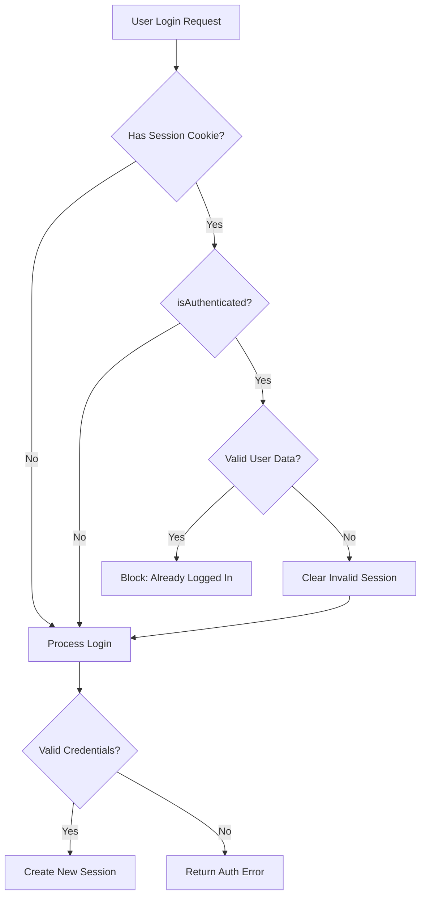

# Design Document: Session Management Fix

## Overview

This design addresses the session management issue where users cannot log in when stale session cookies exist. The solution implements session integrity validation that automatically detects and clears invalid sessions, allowing users to log in without manually clearing browser data.

The core approach is to enhance the `requireNoAuth` middleware to validate session integrity before blocking login attempts, and to improve the Passport.js deserialization to handle missing users gracefully.

## Architecture



## Components and Interfaces

### 1. Enhanced requireNoAuth Middleware

The `requireNoAuth` middleware will be enhanced to validate session integrity before blocking requests.

```typescript
// server/auth-middleware.ts

/**
 * Validates that a session has valid user data
 * Returns true if session is valid, false if it should be cleared
 */
function isValidSession(req: Request): boolean {
  // Session must be authenticated AND have valid user data
  if (!req.isAuthenticated()) {
    return false; // Not authenticated, session is "valid" (empty)
  }
  
  // Check if user data exists and has required fields
  if (!req.user || !req.user.id || !req.user.email) {
    return false; // Authenticated but missing user data - invalid
  }
  
  return true;
}

/**
 * Clears an invalid session and its cookie
 */
async function clearInvalidSession(req: Request, res: Response): Promise<void> {
  return new Promise((resolve) => {
    console.log('🔐 Clearing invalid session:', {
      sessionID: req.sessionID,
      hasUser: !!req.user,
      isAuthenticated: req.isAuthenticated()
    });
    
    req.logout((err) => {
      if (err) {
        console.warn('⚠️ Error during logout:', err);
      }
      
      req.session?.destroy((destroyErr) => {
        if (destroyErr) {
          console.warn('⚠️ Error destroying session:', destroyErr);
        }
        
        // Clear the session cookie
        res.clearCookie('cronkite.sid', {
          path: '/',
          httpOnly: true,
          secure: process.env.NODE_ENV === 'production',
          sameSite: process.env.NODE_ENV === 'production' ? 'none' : 'lax'
        });
        
        resolve();
      });
    });
  });
}

/**
 * Enhanced middleware to check if user is not authenticated
 * Handles stale/invalid sessions gracefully
 */
export const requireNoAuth = async (req: Request, res: Response, next: NextFunction) => {
  // If not authenticated at all, proceed
  if (!req.isAuthenticated()) {
    return next();
  }
  
  // Check if the session has valid user data
  if (!isValidSession(req)) {
    // Session is authenticated but invalid - clear it and proceed
    console.log('🔐 requireNoAuth: Detected invalid session, clearing...');
    await clearInvalidSession(req, res);
    return next();
  }
  
  // Valid authenticated session - block the request
  res.status(400).json({ 
    error: 'Already authenticated',
    message: 'You are already logged in'
  });
};
```

### 2. Enhanced Passport Deserializer

The Passport deserializer will be enhanced to handle missing users gracefully.

```typescript
// server/auth-middleware.ts

passport.deserializeUser(async (id: string, done) => {
  try {
    const storage = await getStorage();
    const user = await storage.getUser(id);
    
    if (!user) {
      // User no longer exists in database - invalidate session
      console.log('🔐 deserializeUser: User not found, invalidating session:', id);
      return done(null, false); // Return false instead of null to signal invalid
    }
    
    done(null, user);
  } catch (error) {
    console.error('🔐 deserializeUser: Error fetching user:', error);
    // On error, return false to invalidate session rather than crashing
    done(null, false);
  }
});
```

### 3. Session Validation Utility

A utility function to validate session state that can be used across middleware.

```typescript
// server/auth-middleware.ts

export interface SessionValidationResult {
  isValid: boolean;
  reason?: 'not_authenticated' | 'missing_user' | 'invalid_user_data' | 'valid';
}

export function validateSession(req: Request): SessionValidationResult {
  if (!req.isAuthenticated()) {
    return { isValid: false, reason: 'not_authenticated' };
  }
  
  if (!req.user) {
    return { isValid: false, reason: 'missing_user' };
  }
  
  if (!req.user.id || !req.user.email) {
    return { isValid: false, reason: 'invalid_user_data' };
  }
  
  return { isValid: true, reason: 'valid' };
}
```

## Data Models

No new data models are required. The fix operates on existing session and user data structures.

### Existing Types Used

```typescript
// From @shared/schema
interface Profile {
  id: string;
  email: string;
  display_name: string;
  avatar_url: string | null;
  timezone: string;
  region_code: string | null;
  onboarding_completed: boolean;
  created_at: Date;
  updated_at: Date;
}

// Express Session
interface Session {
  passport?: {
    user?: string; // User ID
  };
}
```

## Correctness Properties

*A property is a characteristic or behavior that should hold true across all valid executions of a system-essentially, a formal statement about what the system should do. Properties serve as the bridge between human-readable specifications and machine-verifiable correctness guarantees.*

### Property 1: Session Validation Consistency

*For any* request with `isAuthenticated()` returning true, the `validateSession` function SHALL return `isValid: false` if and only if `req.user` is null, undefined, or missing required fields (id, email).

**Validates: Requirements 2.1, 2.2**

### Property 2: Invalid Session Clearing

*For any* login request where `isAuthenticated()` returns true but `req.user` is invalid, the `requireNoAuth` middleware SHALL clear the session and allow the request to proceed (not return 400 error).

**Validates: Requirements 1.1, 1.2, 3.1**

### Property 3: Valid Session Blocking

*For any* login request where both `isAuthenticated()` returns true AND `req.user` contains valid data, the `requireNoAuth` middleware SHALL return a 400 error indicating the user is already logged in.

**Validates: Requirements 4.1**

### Property 4: Deserializer Graceful Handling

*For any* session deserialization where the user ID does not exist in the database, the deserializer SHALL return `false` (not throw an error or return null).

**Validates: Requirements 4.2, 4.3**

## Error Handling

### Session Clearing Errors

When clearing an invalid session fails:
1. Log the error for debugging
2. Continue processing the request (don't block the user)
3. The next request will attempt to clear again

### Deserialization Errors

When user lookup fails during deserialization:
1. Log the error with context
2. Return `false` to Passport (invalidates session)
3. User will be treated as unauthenticated

### Database Connection Errors

When storage is unavailable:
1. Log the error
2. Return `false` from deserializer (safe default)
3. User can retry login when database recovers

## Testing Strategy

### Unit Tests

1. **validateSession function tests**
   - Test with authenticated request and valid user
   - Test with authenticated request and null user
   - Test with authenticated request and user missing id
   - Test with authenticated request and user missing email
   - Test with unauthenticated request

2. **requireNoAuth middleware tests**
   - Test allows unauthenticated requests
   - Test blocks valid authenticated requests
   - Test clears invalid sessions and allows request
   - Test handles session clearing errors gracefully

3. **Deserializer tests**
   - Test returns user when found
   - Test returns false when user not found
   - Test returns false on database error

### Property-Based Tests

Property tests will use fast-check to generate random session states and verify the correctness properties hold across all inputs.

**Test Configuration:**
- Minimum 100 iterations per property test
- Use fast-check for TypeScript property-based testing
- Tag format: **Feature: session-management-fix, Property N: [property_text]**

### Integration Tests

1. **Login with stale session cookie**
   - Create a session, delete the user, attempt login
   - Verify login succeeds after session is auto-cleared

2. **Login with valid session**
   - Create a valid session, attempt login
   - Verify 400 error is returned

3. **Session recovery flow**
   - Simulate corrupted session state
   - Verify system recovers and allows authentication
