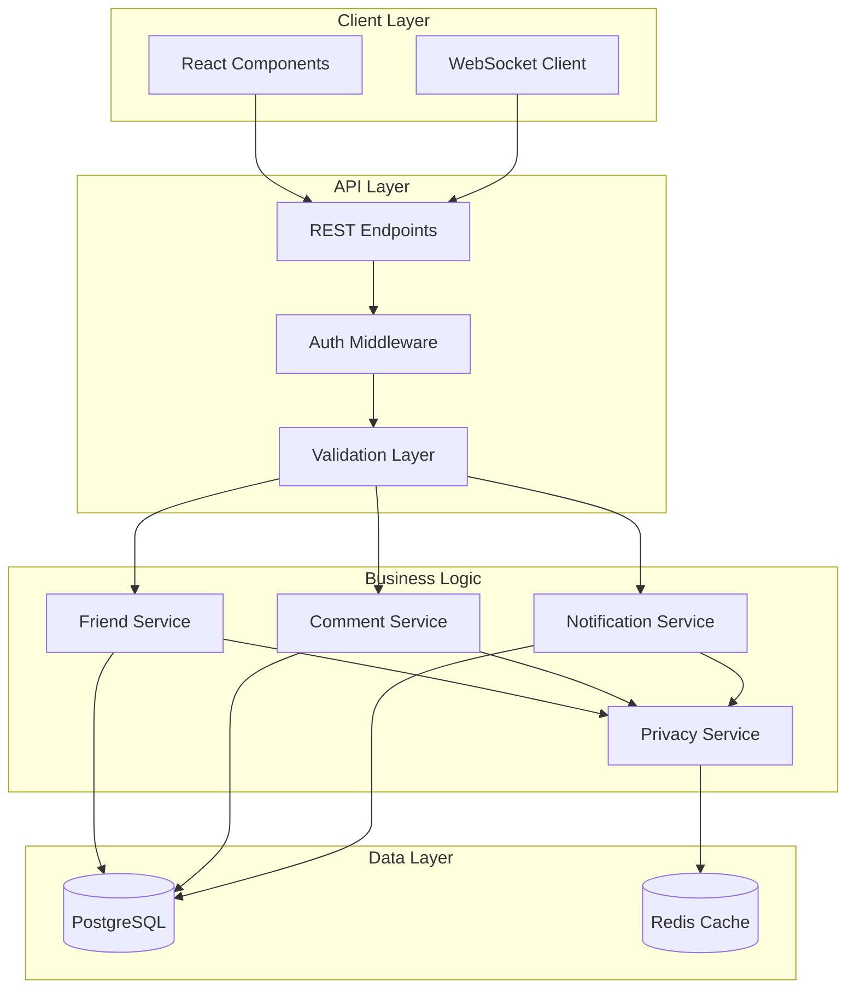

# Design Document: Social Friend System

## Overview

The Social Friend System extends Cronkite's news aggregation platform with privacy-focused social features. The system enables users to connect through mutual friend confirmation and engage in discussions around articles through comments and tagging. The design emphasizes user privacy, intentional connections, and meaningful engagement while maintaining the platform's clean, focused user experience.

## Architecture

The social layer integrates with Cronkite's existing architecture through:

- **Database Extensions**: New tables for friendships, comments, and notifications
- **API Layer**: RESTful endpoints for social operations with proper authentication
- **Real-time Updates**: WebSocket connections for live notifications and comment updates
- **Privacy Controls**: Granular permissions system respecting user preferences
- **Integration Points**: Seamless connection with existing article and user systems



## Components and Interfaces

### Friend Management Service

**Core Responsibilities:**
- Friend request lifecycle management
- Friendship status validation
- User discovery and search
- Privacy enforcement

**Key Methods:**
```typescript
interface FriendService {
  sendFriendRequest(fromUserId: string, toUserId: string): Promise<FriendRequest>
  acceptFriendRequest(requestId: string, userId: string): Promise<Friendship>
  declineFriendRequest(requestId: string, userId: string): Promise<void>
  getFriends(userId: string): Promise<User[]>
  getFriendRequests(userId: string): Promise<FriendRequest[]>
  unfriend(userId: string, friendId: string): Promise<void>
  blockUser(userId: string, blockedUserId: string): Promise<void>
  searchUsers(query: string, currentUserId: string): Promise<User[]>
}
```

### Comment System Service

**Core Responsibilities:**
- Article comment management
- Friend tagging and mention processing
- Comment validation and moderation
- Thread organization

**Key Methods:**
```typescript
interface CommentService {
  addComment(articleId: string, userId: string, content: string): Promise<Comment>
  getComments(articleId: string, userId: string): Promise<Comment[]>
  deleteComment(commentId: string, userId: string): Promise<void>
  processTaggedUsers(content: string, authorId: string): Promise<string[]>
  validateCommentAccess(articleId: string, userId: string): Promise<boolean>
}
```

### Notification Service

**Core Responsibilities:**
- Real-time notification delivery
- Notification preferences management
- Batch processing for efficiency
- Multi-channel delivery (in-app, email)

**Key Methods:**
```typescript
interface NotificationService {
  createNotification(type: NotificationType, data: NotificationData): Promise<Notification>
  getNotifications(userId: string, limit?: number): Promise<Notification[]>
  markAsRead(notificationId: string, userId: string): Promise<void>
  updatePreferences(userId: string, preferences: NotificationPreferences): Promise<void>
  sendRealTimeNotification(userId: string, notification: Notification): Promise<void>
}
```

### Privacy Control Service

**Core Responsibilities:**
- Permission validation
- Privacy setting enforcement
- User visibility controls
- Data access auditing

**Key Methods:**
```typescript
interface PrivacyService {
  canSendFriendRequest(fromUserId: string, toUserId: string): Promise<boolean>
  canViewProfile(viewerId: string, profileUserId: string): Promise<boolean>
  canComment(userId: string, articleId: string): Promise<boolean>
  canTagUser(taggerId: string, taggedUserId: string): Promise<boolean>
  isBlocked(userId: string, otherUserId: string): Promise<boolean>
}
```

## Data Models

### Core Social Tables

```sql
-- Friend relationships with mutual confirmation
CREATE TABLE friendships (
  id UUID PRIMARY KEY DEFAULT gen_random_uuid(),
  user1_id UUID NOT NULL REFERENCES users(id) ON DELETE CASCADE,
  user2_id UUID NOT NULL REFERENCES users(id) ON DELETE CASCADE,
  status friendship_status NOT NULL DEFAULT 'pending',
  requested_by UUID NOT NULL REFERENCES users(id),
  requested_at TIMESTAMP WITH TIME ZONE DEFAULT NOW(),
  confirmed_at TIMESTAMP WITH TIME ZONE,
  created_at TIMESTAMP WITH TIME ZONE DEFAULT NOW(),
  updated_at TIMESTAMP WITH TIME ZONE DEFAULT NOW(),
  
  CONSTRAINT friendship_unique UNIQUE (user1_id, user2_id),
  CONSTRAINT friendship_no_self CHECK (user1_id != user2_id),
  CONSTRAINT friendship_ordered CHECK (user1_id < user2_id)
);

-- Article comments with friend visibility
CREATE TABLE article_comments (
  id UUID PRIMARY KEY DEFAULT gen_random_uuid(),
  article_id UUID NOT NULL REFERENCES articles(id) ON DELETE CASCADE,
  user_id UUID NOT NULL REFERENCES users(id) ON DELETE CASCADE,
  content TEXT NOT NULL,
  tagged_users UUID[] DEFAULT '{}',
  created_at TIMESTAMP WITH TIME ZONE DEFAULT NOW(),
  updated_at TIMESTAMP WITH TIME ZONE DEFAULT NOW(),
  deleted_at TIMESTAMP WITH TIME ZONE,
  
  CONSTRAINT comment_content_length CHECK (length(content) > 0 AND length(content) <= 2000)
);

-- User blocking for privacy
CREATE TABLE user_blocks (
  id UUID PRIMARY KEY DEFAULT gen_random_uuid(),
  blocker_id UUID NOT NULL REFERENCES users(id) ON DELETE CASCADE,
  blocked_id UUID NOT NULL REFERENCES users(id) ON DELETE CASCADE,
  created_at TIMESTAMP WITH TIME ZONE DEFAULT NOW(),
  
  CONSTRAINT block_unique UNIQUE (blocker_id, blocked_id),
  CONSTRAINT block_no_self CHECK (blocker_id != blocked_id)
);

-- Notifications system
CREATE TABLE notifications (
  id UUID PRIMARY KEY DEFAULT gen_random_uuid(),
  user_id UUID NOT NULL REFERENCES users(id) ON DELETE CASCADE,
  type notification_type NOT NULL,
  title VARCHAR(255) NOT NULL,
  message TEXT NOT NULL,
  data JSONB DEFAULT '{}',
  read_at TIMESTAMP WITH TIME ZONE,
  created_at TIMESTAMP WITH TIME ZONE DEFAULT NOW(),
  expires_at TIMESTAMP WITH TIME ZONE
);

-- User privacy settings
CREATE TABLE user_privacy_settings (
  user_id UUID PRIMARY KEY REFERENCES users(id) ON DELETE CASCADE,
  discoverable BOOLEAN DEFAULT true,
  allow_friend_requests_from privacy_level DEFAULT 'everyone',
  show_activity_to privacy_level DEFAULT 'friends',
  email_notifications BOOLEAN DEFAULT true,
  push_notifications BOOLEAN DEFAULT true,
  created_at TIMESTAMP WITH TIME ZONE DEFAULT NOW(),
  updated_at TIMESTAMP WITH TIME ZONE DEFAULT NOW()
);
```

### Enums and Types

```sql
CREATE TYPE friendship_status AS ENUM ('pending', 'confirmed', 'declined');
CREATE TYPE notification_type AS ENUM ('friend_request', 'friend_accepted', 'comment_tag', 'comment_reply');
CREATE TYPE privacy_level AS ENUM ('everyone', 'friends', 'nobody');
```

### Indexes for Performance

```sql
-- Friendship lookups
CREATE INDEX idx_friendships_user1_status ON friendships(user1_id, status);
CREATE INDEX idx_friendships_user2_status ON friendships(user2_id, status);
CREATE INDEX idx_friendships_requested_by ON friendships(requested_by);

-- Comment queries
CREATE INDEX idx_article_comments_article_id ON article_comments(article_id) WHERE deleted_at IS NULL;
CREATE INDEX idx_article_comments_user_id ON article_comments(user_id) WHERE deleted_at IS NULL;
CREATE INDEX idx_article_comments_tagged_users ON article_comments USING GIN(tagged_users);

-- Notification queries
CREATE INDEX idx_notifications_user_id_created ON notifications(user_id, created_at DESC);
CREATE INDEX idx_notifications_user_id_unread ON notifications(user_id) WHERE read_at IS NULL;

-- Privacy and blocking
CREATE INDEX idx_user_blocks_blocker ON user_blocks(blocker_id);
CREATE INDEX idx_user_blocks_blocked ON user_blocks(blocked_id);
```

## Correctness Properties

*A property is a characteristic or behavior that should hold true across all valid executions of a system—essentially, a formal statement about what the system should do. Properties serve as the bridge between human-readable specifications and machine-verifiable correctness guarantees.*

Now I need to analyze the acceptance criteria to determine which ones can be tested as properties:

### Converting EARS to Properties

Based on the prework analysis, I'll convert the testable acceptance criteria into universally quantified properties, combining related properties to eliminate redundancy:

**Property 1: Friend request state transitions**
*For any* friend request in the system, the state transitions (pending → confirmed/declined) should always create appropriate notifications and maintain data consistency
**Validates: Requirements 1.2, 1.4, 1.5**

**Property 2: Mutual confirmation requirement**
*For any* friendship in the system, it should only exist if both users have explicitly confirmed the relationship
**Validates: Requirements 2.1**

**Property 3: Duplicate request prevention**
*For any* pair of users, only one pending friend request should exist between them at any time
**Validates: Requirements 1.6**

**Property 4: Privacy boundary enforcement**
*For any* social interaction (comments, tags, feeds), it should only be visible to users who have confirmed friendships with the content creator
**Validates: Requirements 3.4, 5.4, 6.3**

**Property 5: Friendship permissions consistency**
*For any* confirmed friendship, both users should have symmetric permissions to view comments and tag each other
**Validates: Requirements 2.2**

**Property 6: Unfriend cleanup completeness**
*For any* unfriend operation, all associated permissions and social interactions should be immediately revoked
**Validates: Requirements 2.3**

**Property 7: Friends list accuracy**
*For any* user's friends list, it should contain exactly the users with whom they have confirmed friendships
**Validates: Requirements 2.4**

**Property 8: Block enforcement completeness**
*For any* user who blocks another user, all social interactions and discovery should be prevented in both directions
**Validates: Requirements 2.5, 6.3**

**Property 9: Comment validation consistency**
*For any* comment being saved, it should pass all validation rules and only reference valid friend tags
**Validates: Requirements 3.2, 4.5**

**Property 10: Comment deletion completeness**
*For any* comment deletion by its author, the comment should be completely removed from all displays and storage
**Validates: Requirements 3.3**

**Property 11: Tag autocomplete accuracy**
*For any* autocomplete request during tagging, suggestions should only include confirmed friends whose usernames match the input
**Validates: Requirements 4.1**

**Property 12: Tag notification creation**
*For any* comment containing friend tags, notifications should be created for all tagged friends who are confirmed friends
**Validates: Requirements 4.2**

**Property 13: Tag permission enforcement**
*For any* attempt to tag a user, it should only succeed if the tagger and tagged user are confirmed friends
**Validates: Requirements 4.4**

**Property 14: Social feed content filtering**
*For any* user's social feed, it should only contain articles with activity from confirmed friends
**Validates: Requirements 5.1, 5.2**

**Property 15: Privacy settings enforcement**
*For any* privacy setting change, all subsequent interactions should respect the new privacy level
**Validates: Requirements 6.1, 6.2**

**Property 16: Notification delivery consistency**
*For any* social event that should trigger notifications, notifications should be delivered through all channels specified in user preferences
**Validates: Requirements 7.1, 7.2, 7.5**

**Property 17: Notification preferences respect**
*For any* notification delivery, it should only occur if the user's preferences allow that type and frequency of notification
**Validates: Requirements 7.3, 7.4**

**Property 18: Search privacy compliance**
*For any* user search, results should only include users whose privacy settings allow discovery by the searcher
**Validates: Requirements 8.1, 8.3**

**Property 19: Friend suggestion accuracy**
*For any* friend suggestion, the suggested user should have at least one mutual connection with the requesting user
**Validates: Requirements 8.2**

**Property 20: Data portability completeness**
*For any* user requesting data export or deletion, all their social data should be included in export or completely removed in deletion
**Validates: Requirements 6.5**

## Error Handling

### Friend Request Errors
- **Duplicate Requests**: Prevent sending multiple requests to the same user
- **Self Requests**: Block users from sending friend requests to themselves  
- **Blocked Users**: Reject friend requests between blocked users
- **Invalid Users**: Validate user existence before processing requests

### Comment System Errors
- **Content Validation**: Enforce length limits and content policies
- **Permission Errors**: Verify friendship before allowing comments
- **Invalid Tags**: Validate tagged usernames against friend lists
- **Deleted Content**: Handle graceful degradation for deleted comments

### Privacy Violations
- **Access Control**: Strict enforcement of privacy boundaries
- **Data Leakage**: Prevent exposure of private information through API responses
- **Permission Escalation**: Validate permissions at every interaction point
- **Audit Logging**: Track privacy-sensitive operations for compliance

### Notification Failures
- **Delivery Failures**: Implement retry mechanisms for failed notifications
- **Preference Conflicts**: Handle conflicting notification preferences gracefully
- **Rate Limiting**: Prevent notification spam through intelligent batching
- **Channel Failures**: Fallback to alternative notification channels

## Testing Strategy

### Dual Testing Approach

The social friend system requires both **unit tests** and **property-based tests** for comprehensive coverage:

**Unit Tests** focus on:
- Specific friend request scenarios (accept, decline, block)
- Comment creation and deletion workflows
- Privacy setting changes and their immediate effects
- Notification delivery for specific events
- Error conditions and edge cases

**Property-Based Tests** verify universal properties across all inputs:
- All friendship relationships maintain mutual confirmation
- Privacy boundaries are never violated regardless of input
- Comment visibility always respects friendship status
- Notification delivery matches user preferences consistently
- Search results always respect privacy settings

### Property-Based Testing Configuration

**Testing Framework**: Use **fast-check** for TypeScript property-based testing
**Test Configuration**: Minimum 100 iterations per property test
**Test Tagging**: Each property test must reference its design document property

**Tag Format**: `// Feature: social-friend-system, Property {number}: {property_text}`

**Example Property Test Structure**:
```typescript
// Feature: social-friend-system, Property 2: Mutual confirmation requirement
test('friendship mutual confirmation', () => {
  fc.assert(fc.property(
    fc.record({
      user1: userGenerator(),
      user2: userGenerator(),
      requestDirection: fc.constantFrom('user1_to_user2', 'user2_to_user1')
    }),
    async ({ user1, user2, requestDirection }) => {
      // Test that friendships only exist with mutual confirmation
      const friendship = await createFriendshipScenario(user1, user2, requestDirection);
      expect(friendship.status).toBe('confirmed');
      expect(friendship.mutuallyConfirmed).toBe(true);
    }
  ));
});
```

### Integration Testing

**Database Transactions**: Test complex social operations within transactions
**Real-time Features**: Validate WebSocket notification delivery
**Privacy Enforcement**: End-to-end testing of privacy boundary enforcement
**Performance Testing**: Validate system performance under social load
**Cross-Feature Integration**: Test social features with existing article and user systems

### Test Data Generation

**Smart Generators** for property-based testing:
- **User Networks**: Generate realistic social graphs with varying connection patterns
- **Comment Threads**: Create nested comment structures with realistic tagging patterns
- **Privacy Scenarios**: Generate diverse privacy setting combinations
- **Notification Batches**: Create realistic notification delivery scenarios
- **Edge Cases**: Generate boundary conditions for friend limits, comment lengths, etc.

The testing strategy ensures that the social friend system maintains correctness, privacy, and performance while integrating seamlessly with Cronkite's existing architecture.